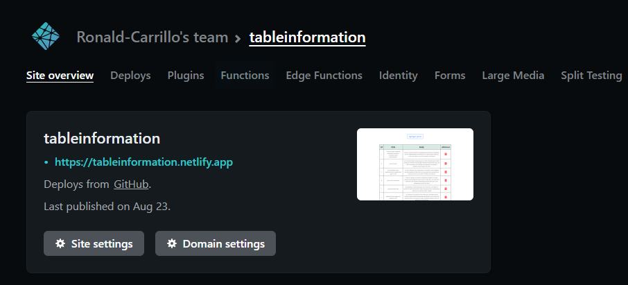
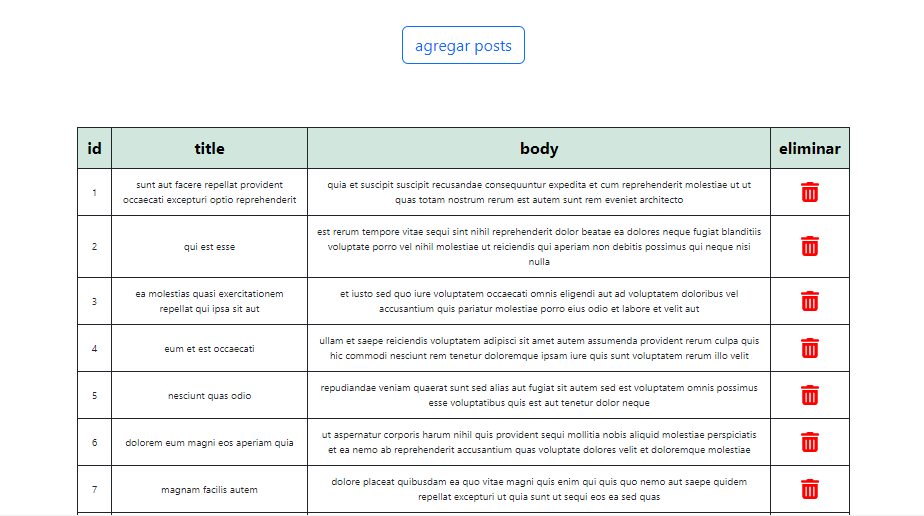

### Proyecto con ReactJs 

- Este proyecto fue creado con Create React App.

###*npm start*

Runs the app in the development mode.
Open http://localhost:3000 to view it in the browser.

###*Learn More*
**
You can learn more in the Create React App documentation.

To learn React, check out the React documentation.

###*Landing Page*
Proyecto creado para el uso de los servicios de la API REST jsonplaceholder

#construida con 
-ReactJs 
-boostrap
-javascript

#Despliegue

desplegado con netlify

 

 [LINK](https://tableinformation.netlify.app/)

 